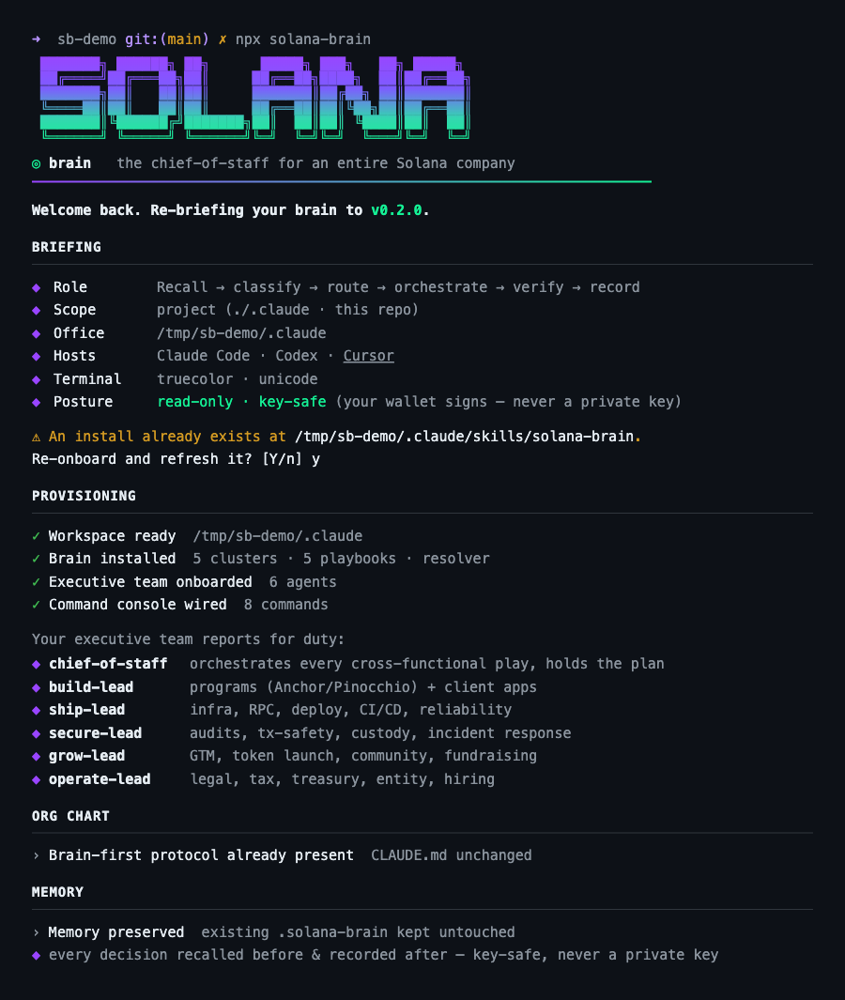
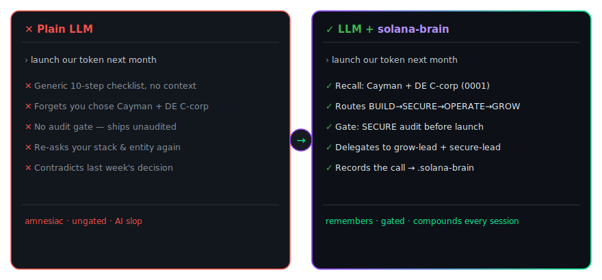
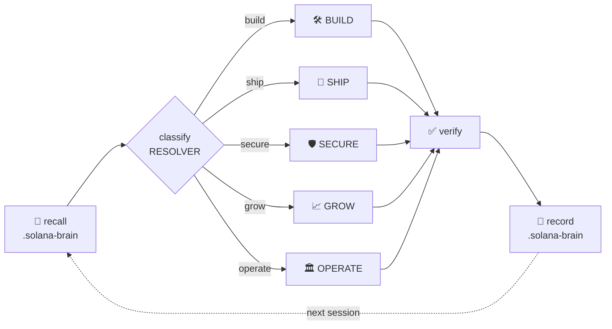
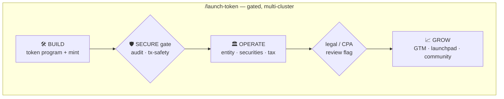
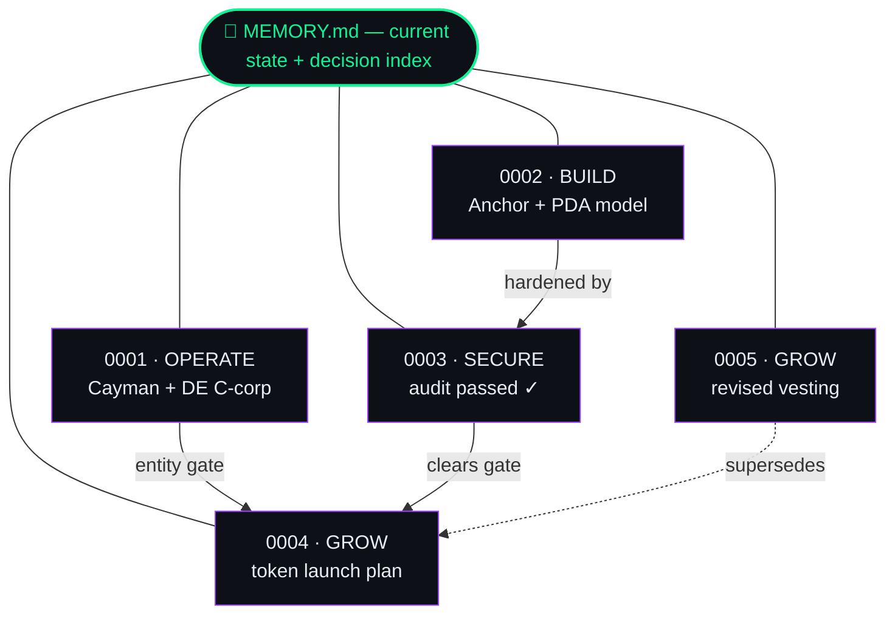

<div align="center">

# 🧠 solana-brain

### The chief-of-staff for an entire Solana company.

**One skill you drop into _any_ repo — brand-new or mid-flight — that knows the whole job:
`build · ship · secure · grow · operate`.** It's not another vertical skill. It's an **intelligent
router** that classifies any request, sends it to the right one of five clusters, sequences
cross-functional work with non-negotiable gates, **delegates depth to the best existing ecosystem
skills**, and **remembers every decision** so it's never re-litigated.

**Drop it in and your repo grows a brain** — every consequential decision becomes a connected node in a
living, Obsidian-ready knowledge graph, so your AI stops producing slop and gets sharper the more you build.

<br/>


<br/>

> _"Search gives you skills. The brain gives you the **move**."_

</div>

> **Read-only / key-safe.** solana-brain plans, builds, simulates, routes, and reviews. It never asks
> for or uses a private key or seed phrase, and never auto-signs or moves funds. **Your wallet signs.**

---

## ✅ Live on every channel

> **All three install paths are published and verified end-to-end** against real infrastructure — the npm registry, a tagged GitHub release, and a Homebrew tap.

| Channel | Command | Status |
|---|---|---|
| **curl** | `curl -fsSL …/install.sh \| bash` | ✅ live |
| **npm** | `npx solana-brain` · `npm i -g solana-brain` | ✅ live |
| **Homebrew** | `brew install Sushant6095/tap/solana-brain` | ✅ live |

**Live links:** [📦 npm — npmjs.com/package/solana-brain](https://www.npmjs.com/package/solana-brain) · [🍺 Homebrew tap](https://github.com/Sushant6095/homebrew-tap) · [🏷 Release v0.2.0](https://github.com/Sushant6095/solana-brain/releases/tag/v0.2.0)

<p align="center">
  
</p>

> _Clean by design: `npm i solana-brain` in a fresh project adds **1 package · 0 dependencies · 0 vulnerabilities**._

---

## Contents

- [✅ Live on every channel](#-live-on-every-channel)

- [The problem](#the-problem)
- [Why every Solana dev & founder needs it](#why-every-solana-dev--founder-needs-it)
- [Before & after: how your agent changes](#before--after-how-your-agent-changes)
- [Works with any LLM or agent](#works-with-any-llm-or-agent)
- [⚡ Drop it into your repo — new project _or_ mid-flight](#-drop-it-into-your-repo--new-project-or-mid-flight)
- [Install](#install)
- [What lands in your repo](#what-lands-in-your-repo)
- [The five clusters](#the-five-clusters)
- [How the brain works](#how-the-brain-works-the-loop)
- [Orchestration — the real edge](#orchestration--the-real-edge)
- [Use it](#use-it)
- [🧠 Your repo grows a brain](#-your-repo-grows-a-brain)
- [🧬 It evolves — and it teaches you](#-it-evolves--and-it-teaches-you)
- [Routes to the ecosystem (doesn't reinvent it)](#routes-to-the-ecosystem-doesnt-reinvent-it)
- [Agents & commands](#agents--commands)
- [Where it fits in the Solana AI Kit](#where-it-fits-in-the-solana-ai-kit)
- [🔌 For Solana AI Kit maintainers](#-for-solana-ai-kit-maintainers)
- [Repository structure](#repository-structure)
- [Safety model](#safety-model)
- [Versioning · Compatibility · Uninstall](#versioning--compatibility--uninstall)
- [Contributing · License](#contributing--license)

---

## The problem

Building on Solana isn't one job — it's five, and they're entangled. A token launch isn't a "growth"
task; it's a **program** you must **secure**, wrapped in an **entity** with **tax/securities**
exposure, then taken to market. The expensive mistakes aren't usually bad code — they're **skipped
gates** (shipping unaudited, launching before legal) and **re-litigated decisions** (re-deciding the
entity structure three sessions later because nobody wrote down why).

Skill catalogs and search help you find _a_ tool. They don't tell you **what to do next across the
whole company**, **in what order**, **with which gate**, **remembering what you already decided.**

That's the gap solana-brain fills. It's the connective tissue specialists don't provide:
**classification + sequencing + gates + verification + memory.**

---

## Why every Solana dev & founder needs it

Solana is a five-front job — build, ship, secure, grow, operate — usually fought by a tiny team, often
**one founder wearing all five hats** while pair-programming with an AI that forgets everything between
sessions. That amnesia is where **AI slop** comes from: an agent with no memory of your decisions
improvises, repeats work, and contradicts itself.

solana-brain is the layer that fixes it:

- **Less slop, more signal.** The agent recalls your *actual* decisions before it acts — so it stops
  re-deriving the entity, re-litigating the stack, and quietly walking back the audit.
- **It gets better every day.** Every recorded decision makes the next session sharper. The
  intelligence **compounds with your repo** instead of resetting each morning.
- **Nothing critical gets skipped.** Gates are enforced — SECURE before you ship, OPERATE before you
  launch a token — not left to luck.
- **It meets you where you are.** Fresh repo or 50k-line codebase: one command at the root,
  non-destructive, zero dependencies, read-only / key-safe.

If you build or operate anything on Solana with a coding agent, this is the layer that makes that agent
**trustworthy over time** — and it installs in one command.

---

## Before & after: how your agent changes

Same prompt — *"launch our token next month"* — to the **same model**, before and after installing the brain:

<p align="center">
  
</p>

| | 🤖 Plain LLM | 🧠 LLM + solana-brain |
|---|---|---|
| **Memory** | Forgets between sessions | Recalls every prior decision from `.solana-brain/` |
| **Answer** | One generic checklist | Classified into the right cluster(s) |
| **Gates** | Skips audit / legal | SECURE before ship · OPERATE before launch — *enforced* |
| **Depth** | Reinvents, often wrong | Delegates to specialists (Helius · Jupiter · Trail of Bits · …) |
| **Over time** | Same slop, every day | **Compounds** — sharper every session |

---

## Works with any LLM or agent

solana-brain is **plain markdown** — a routing protocol, five cluster playbooks, and a memory format.
No binary, no runtime, no SDK lock-in. That makes it **model- and tool-agnostic**:

- **Any agent that reads `CLAUDE.md` / `AGENTS.md` / skills** — Claude Code, Codex, Cursor, Cline,
  Windsurf, Gemini CLI, and more. The installer wires `.claude/` and appends the brain-first protocol
  automatically.
- **Any raw LLM** — point the model at [`skill/SKILL.md`](skill/SKILL.md) as context and it routes the
  same way, whether that's Claude, GPT, Gemini, or a local Llama.
- **The memory is just markdown** — readable by you, your team, your agent, and Obsidian alike.

**One brain, any model.** Swap LLMs whenever you like — your repo's brain and its decision graph stay put.

---

## ⚡ Drop it into your repo — new project _or_ mid-flight

solana-brain installs **into the repo you're standing in.** No framework to adopt, no restructuring,
no lock-in. You run **one command at your project root** and it provisions a `.claude/` brain plus a
`.solana-brain/` memory store right there — and from then on every coding-agent session in that repo
**consults the brain first** before improvising.

| Your situation | What happens |
|---|---|
| 🌱 **Bootstrapping a brand-new project** | Run it in the fresh/empty repo. You get the full `BUILD → SHIP → SECURE → GROW → OPERATE` playbook, six executive agents, eight commands, and a clean institutional-memory store from line one. |
| 🛠 **Already deep in an existing codebase** | Run it at the root of your repo. It's **non-destructive** — never touches your source, never wipes an existing `.solana-brain/` — appends a brain-first protocol to your `CLAUDE.md`, and meets you exactly where you are. |
| 🔁 **Re-running later (upgrades)** | Idempotent. Re-running preserves your accumulated memory and decisions; it only refreshes the skill files. |

```bash
cd your-solana-repo     # new or existing — doesn't matter, it works at the root
curl -fsSL https://raw.githubusercontent.com/Sushant6095/solana-brain/main/install.sh | bash
# → .claude/ (brain · agents · commands) + .solana-brain/ (memory) provisioned at your repo root
```

That's the whole onboarding. Open your agent and say `/brain what should we do next` — or just describe
a goal in plain language.

---

## Install

**Zero-install, works today — into the current repo (recommended):**

```bash
curl -fsSL https://raw.githubusercontent.com/Sushant6095/solana-brain/main/install.sh | bash
```

**User-wide (all your projects, into `~/.claude`):**

```bash
curl -fsSL https://raw.githubusercontent.com/Sushant6095/solana-brain/main/install.sh | bash -s -- --user
```

**Other channels** — every one runs the same installer:

```bash
# npm — run without installing, or install the command globally
npx solana-brain                 # onboard into the current repo
npx solana-brain --user          # onboard user-wide (~/.claude)
npm install -g solana-brain      # then run:  solana-brain   (any flag works)

# Homebrew (via a tap)
brew install Sushant6095/tap/solana-brain && solana-brain
brew install --HEAD Sushant6095/tap/solana-brain   # bleeding edge from main

# Let your agent install it (Claude Code / Codex / Cursor)
#   point it at: https://raw.githubusercontent.com/Sushant6095/solana-brain/main/INSTALL_FOR_AGENTS.md
```

The installer is a paced, branded onboarding — Solana-gradient banner, live verification, your
executive team reporting for duty — that **degrades cleanly** over `curl | bash`, `NO_COLOR`, and
non-UTF-8 terminals. Flags: `--user`, `--project DIR`, `-y`, `--fast`, `--plain`.

> **No build step. No runtime dependencies** (the npm path needs Node ≥ 16 + bash). Supply your own
> RPC/provider keys by environment variable — the brain never bundles, requests, or stores keys.

---

## What lands in your repo

Running the installer at your repo root drops exactly this — and nothing else:

```text
your-solana-repo/
├── .claude/
│   ├── skills/solana-brain/      # the router: SKILL.md · RESOLVER.md · clusters/ · references/
│   ├── agents/                   # chief-of-staff + 5 cluster leads
│   └── commands/                 # /brain /company-setup /ship-it /launch-token /raise /incident /recall /remember
├── .solana-brain/                # your institutional memory (git-trackable, tool-agnostic)
│   ├── MEMORY.md                 #   snapshot + decisions index (recalled first, every session)
│   ├── profile.md                #   durable company facts
│   └── decisions/                #   one ADR-style record per consequential decision
└── CLAUDE.md                     # brain-first protocol appended (your code is untouched)
```

Your source code, build config, and existing files are **never modified** — only `CLAUDE.md` gets a
clearly-fenced protocol block appended. To remove it entirely: delete `.claude/skills/solana-brain/`
and `.solana-brain/`.

---

## The five clusters

| | Cluster | Owns |
|---|---|---|
| 🛠 | **BUILD** | Programs (Anchor/Pinocchio) + client apps — tx landing, safety, Actions/Blinks, streaming, frontends |
| 🚀 | **SHIP** | Infra, RPC, deploy, CI/CD, observability, reliability, on-call readiness |
| 🛡 | **SECURE** | Program audits, client/user tx-safety, key/treasury custody, supply chain, incident response — _the cross-cutting gate_ |
| 📈 | **GROW** | GTM, token launch, community, fundraising, hackathons, growth analytics |
| 🏛 | **OPERATE** | Legal/compliance, tax/accounting, treasury, entity formation, hiring — _informational; flags counsel/CPA_ |

---

## How the brain works (the loop)



`recall → intake → classify → route → orchestrate → hand off → verify → record.` Progressive
disclosure means only the cluster file the request actually needs is ever loaded — the brain stays
small and token-efficient. Full loop in [`skill/SKILL.md`](skill/SKILL.md).

---

## Orchestration — the real edge

Single-cluster questions are easy. The brain earns its keep on **cross-functional goals**, where it
sequences clusters with **gates** and won't let a critical one get skipped silently:



A token launch is **not** "GROW." It's `BUILD → SECURE → OPERATE → GROW`, with a gate between each.
Skipping the SECURE or OPERATE gate is the classic, expensive mistake — the brain surfaces it instead
of marching past it. Playbooks live in [`skill/references/orchestration.md`](skill/references/orchestration.md).

---

## Use it

Just talk to the brain — it figures out the cluster(s):

```text
/brain         we want to launch a token next month
/company-setup my-solana-startup
/ship-it       the vault program
/launch-token  governance token, US + India users
/raise         hackathon: Colosseum
/incident      our claim endpoint is draining wallets
/recall        where were we — what have we already decided
/remember      chose Cayman foundation + DE C-corp for the token entity, per counsel
```

…or describe a goal in plain language and the `chief-of-staff` returns a gated, multi-cluster plan.
It **recalls** the project's memory before routing and **records** every decision after verifying.

---

## 🧠 Your repo grows a brain

Most coding agents are brilliant and **amnesiac** — every session they re-derive your entity, re-litigate
the RPC choice, and quietly contradict last week's audit call. solana-brain fixes that at the root: it
**captures every consequential decision as a node** and wires those nodes into a graph that lives in your
repo.

**Recall before routing, record after verifying** — the loop is
`recall → classify → route → orchestrate → verify → record`. Each consequential, gated, or irreversible
call becomes an append-only ADR node in `.solana-brain/decisions/`, indexed in `MEMORY.md`, and connected
to the calls it supersedes with Obsidian-style `[[wikilinks]]`:



Because it's **plain markdown with `[[wikilinks]]`**, `.solana-brain/` literally *is* an
[Obsidian](https://obsidian.md)-ready vault — open the folder and your company's decisions render as a
navigable graph: every call a node, every supersession an edge. It's git-trackable, tool-agnostic, and
**key-safe** (public keys, program IDs, decisions, and rationale only — never a private key or seed). The
installer **never wipes** an existing `.solana-brain/`; decisions are _superseded_, never overwritten.

**The payoff: your AI compounds.** Week one it's a router. By month three it's an operator that already
knows your entity, your stack, your audit status, and *why* every call was made — so it stops producing
slop and starts producing work consistent with everything decided before it.

Surface it with [`/recall`](commands/recall.md); write it with [`/remember`](commands/remember.md).
Full protocol: [`skill/references/memory.md`](skill/references/memory.md).

---

## 🧬 It evolves — and it teaches you

Two disciplines run on top of every task — both designed to **fight AI slop, not add to it.**

### Gets sharper every prompt — without hallucinating

The brain improves over time, but **only from evidence.** After a verified task it can record one
**grounded learning** to `.solana-brain/learnings.md`, and the bar is strict:

- **No evidence, no entry.** A learning must cite a real artifact — an error message, a transaction
  signature, a test/benchmark result, a PR, a `file:line`, or a dated primary-doc link. Can't cite it?
  It isn't recorded.
- **Confidence ladder.** New observation → `hypothesis` (flagged, never overrides a decision). A
  definitive outcome or a second independent observation → `confirmed`. Contradicted → `superseded`,
  never deleted.
- **The skill never rewrites itself.** Evolution is *data in your repo's memory*, not mutation of the
  skill's playbooks — bounded, auditable, key-safe. Recall reads these learnings before the next task,
  so the brain **compounds instead of hallucinating.**

`/evolve` captures or reviews them. Protocol: [`self-evolve.md`](skill/references/self-evolve.md).

### Build it, then teach it

The default AI workflow — **task → prompt → code → done → no understanding** — is **forbidden.** After
the engineering work, the brain *also teaches it*, so building with AI grows your skills instead of
hollowing them out. For everything that changed it answers:

- **Why** it exists · **why this design** (and what alternatives were rejected) · the **tradeoffs**
  (time, space, complexity, coupling, cost, CU/rent) · **what happens at scale** (10×, 1000×, 100M,
  concurrency) · the **CS / Rust / systems principles** in play · **how a Staff engineer** would review it.

It leads with the **Solana / Rust / Web3** concept lens — accounts & rent, PDAs/CPIs, compute units &
fees, Sealevel parallelism & contention, Borsh vs zero-copy, ownership/lifetimes, `checked_*` math,
security invariants — anchored to your actual diff, with real numbers.

`/explain` ("teach me this", "deep dive", "learning report") triggers it on demand; it's automatic after
engineering work. Protocol: [`teaching.md`](skill/references/teaching.md).

---

## Routes to the ecosystem (doesn't reinvent it)

The brain's value is **classification + orchestration + verification** — not re-implementing skills
that already exist. At the leaf of every route, it delegates to the best specialist:

| Cluster | Delegates depth to |
|---|---|
| 🛠 **BUILD** | `solana-dev` (Foundation) · `pinocchio` (SendAI) · `solana-client-layer` · `sendai` / `jupiter` (DeFi) · `metaplex` (NFTs) · `eth-to-sol` · `solana-mobile` · `solana-game` |
| 🚀 **SHIP** | `helius` · `quicknode` · `cloudflare` · `vercel` · `surfpool` |
| 🛡 **SECURE** | `trailofbits` · `sendai` (vulnhunter) · `qedgen` (formal verification) · `safe-solana-builder` · `solana-client-layer` (tx-safety) |
| 📈 **GROW** | `colosseum` (Copilot) · `solana-new` (SendAI) · `sendai` (launchpads) |
| 🏛 **OPERATE** | `crypto-legal` (US/EU/BR/IN) · `solana-accounting` |

This is why the brain stays **small and current**: it links and routes, it doesn't duplicate. Full
map in [`skill/references/ecosystem-map.md`](skill/references/ecosystem-map.md).

---

## Agents & commands

**Executive team** — six agents, invoked automatically by the router:

| Agent | Role | Model |
|---|---|---|
| [`chief-of-staff`](agents/chief-of-staff.md) | Orchestrator — classifies, routes, sequences multi-cluster work, holds the plan | opus |
| [`build-lead`](agents/build-lead.md) | Programs + client apps | opus |
| [`ship-lead`](agents/ship-lead.md) | Infra, deploy, reliability | sonnet |
| [`secure-lead`](agents/secure-lead.md) | Security across program / client / ops | opus |
| [`grow-lead`](agents/grow-lead.md) | GTM, token, community, fundraising | sonnet |
| [`operate-lead`](agents/operate-lead.md) | Legal, tax, treasury, entity, hiring | sonnet |

**Commands** — each maps to a real workflow, most span multiple clusters:

| Command | Spans | Purpose |
|---|---|---|
| [`/brain`](commands/brain.md) | any | Universal entry — intake + route to the right cluster(s) |
| [`/company-setup`](commands/company-setup.md) | OPERATE + BUILD | 0→1: entity, repo, environments, baseline |
| [`/ship-it`](commands/ship-it.md) | BUILD + SHIP + SECURE | Mainnet-readiness gate → deploy |
| [`/launch-token`](commands/launch-token.md) | BUILD + SECURE + GROW + OPERATE | End-to-end token launch with gates |
| [`/raise`](commands/raise.md) | GROW + OPERATE | Fundraising / hackathon / grant prep |
| [`/incident`](commands/incident.md) | SECURE + SHIP | Incident-response runbook |
| [`/recall`](commands/recall.md) | any | Surface institutional memory before acting |
| [`/remember`](commands/remember.md) | any | Record a decision/fact to institutional memory |

---

## Where it fits in the Solana AI Kit

Complementary, not overlapping. The [Solana AI Kit](https://github.com/solanabr/solana-ai-kit) is a
full dev-config aggregator (agents/commands/rules + ecosystem submodules) focused on **building**.
solana-brain is a single installable **operator's brain** for the **whole company lifecycle** — it
routes across build **and** ship/secure/grow/operate, installs into any repo with one command, injects
a brain-first protocol, and orchestrates gated cross-functional workflows. It **delegates to the kit's
skills** rather than replacing them.

It also follows the kit's reference shape (`solana-game-skill`): a `skill/` folder with a `SKILL.md`
entry point that routes to focused `.md` files (progressive, token-efficient loading), plus optional
`agents/`, `commands/`, `rules/`, an installer, and a clear README — so it slots straight in.

**What makes it production-grade, not slop:**

- ✅ **Useful & recurring** — solves the cross-domain "what's the next move, in what order, with which
  gate" problem every founder/engineer hits, not a toy demo.
- ✅ **Novel** — an orchestration-and-memory layer over the ecosystem; nothing in Solana sequences
  build→secure→operate→grow with gates and remembers the decisions.
- ✅ **Quality** — progressive/token-efficient loading, every install path tested end-to-end (curl,
  npx, global, brew), read-only/key-safe, current to the 2026-06 stack, no shady executables.
- ✅ **Fit** — matches the kit's `SKILL.md`-routing structure, MIT-licensed, ready to be merged or
  submoduled.

---

## 🔌 For Solana AI Kit maintainers

If solana-brain earns a slot in the kit, adding it is **one submodule** — it's wired exactly like the
existing `.claude/skills/ext/*` skills, and uses the same `skill/SKILL.md` layout as the reference
`solana-game-skill`:

```bash
git submodule add https://github.com/Sushant6095/solana-brain.git .claude/skills/ext/solana-brain
```

Because the brain **routes to** the kit's existing `ext/` skills (`solana-dev`, `helius`, `jupiter`,
`metaplex`, `trailofbits`, `qedgen`, `colosseum`, `solana-new`, …) instead of duplicating them, merging
it adds **no overlap** — it becomes the orchestration + memory layer on top of what's already there.

**Full step-by-step** — submodule wiring, an optional `skill-registry.json` entry, the cluster → `ext/`
delegation map, and how to pin/update — lives in **[INTEGRATION.md](INTEGRATION.md)**.

---

## Repository structure

```text
solana-brain/
├── skill/
│   ├── SKILL.md                 # the brain: recall → classify → route → orchestrate → verify → record
│   ├── RESOLVER.md              # intent → cluster routing table
│   ├── clusters/                # build · ship · secure · grow · operate
│   ├── references/              # orchestration · ecosystem-map · company-lifecycle · memory · accuracy-and-safety · changelog-pinning
│   └── memory-template/         # seed for a project's .solana-brain/ (MEMORY.md · profile.md · decisions/)
├── agents/                      # chief-of-staff (orchestrator) + 5 cluster leads
├── commands/                    # /brain /company-setup /ship-it /launch-token /raise /incident /recall /remember
├── rules/                       # brain-first · safety-and-keys
├── bin/solana-brain.mjs         # npm entry point (runs install.sh; cross-platform)
├── install.sh                   # premium installer (curl|bash, npx, brew, run-from-clone)
├── INSTALL_FOR_AGENTS.md        # agent-driven install flow
├── solana-brain.rb              # Homebrew formula
├── package.json                 # npm metadata + bin
├── CLAUDE.md / AGENTS.md        # agent entry points + brain-first protocol
├── llms.txt                     # machine-readable doc map
└── LICENSE                      # MIT
```

---

## Safety model

- **Read-only / key-safe by default.** No private keys; the wallet signs; no auto-send or movement of
  funds. See [`rules/safety-and-keys.md`](rules/safety-and-keys.md).
- **OPERATE is informational only.** Legal/tax/compliance guidance is not advice — it cites sources and
  flags counsel/CPA review.
- **Gates are non-negotiable.** SECURE before SHIP/GROW; OPERATE (legal/tax) before a token launch.
- **Current + cited.** Defaults to the 2026 stack, pins "current as of 2026-06", and verifies
  fast-moving specifics against primary docs.

---

## Versioning · Compatibility · Uninstall

- **Versioning** — router/orchestration logic is semver (`0.2.0` — adds institutional memory +
  npm/brew install); fast-moving facts the clusters reference are calendar-pinned `2026-06`. See
  [`skill/references/changelog-pinning.md`](skill/references/changelog-pinning.md).
- **Compatibility** — Claude Code · Codex · Cursor (anything that reads `.claude/` skills + `CLAUDE.md`).
- **Uninstall** — delete `.claude/skills/solana-brain/` and `.solana-brain/`, and remove the fenced
  brain-first block from `CLAUDE.md`. No residue.

---

## Contributing · License

Add clusters/playbooks, expand the ecosystem map, or wire new specialist skills. Keep the brain a
**router** — push depth into specialist skills, not into the brain. Read-only / key-safe; cite primary
docs for time-sensitive specifics.

**MIT** — see [LICENSE](LICENSE).
